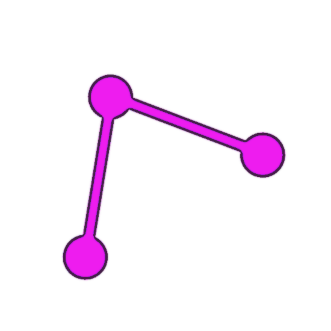
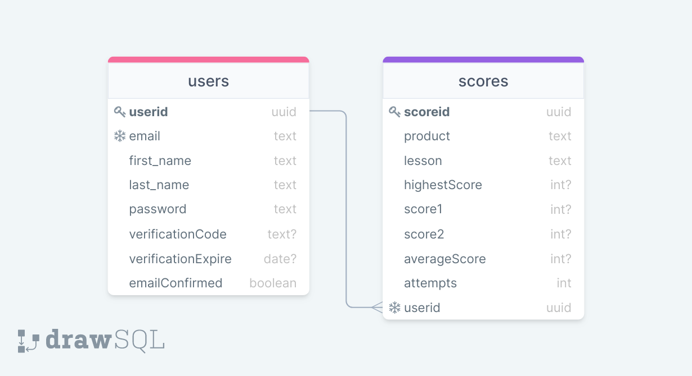
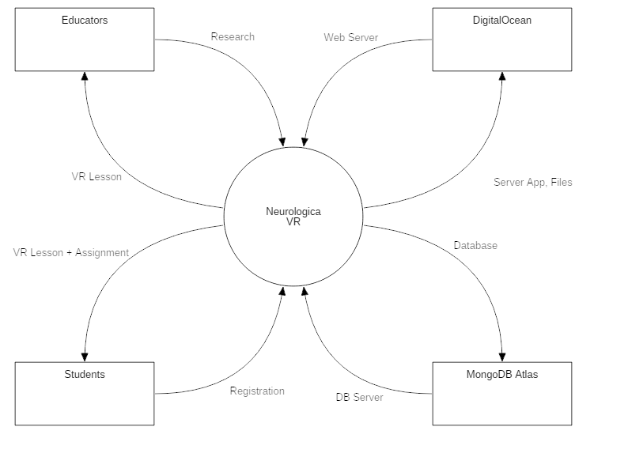
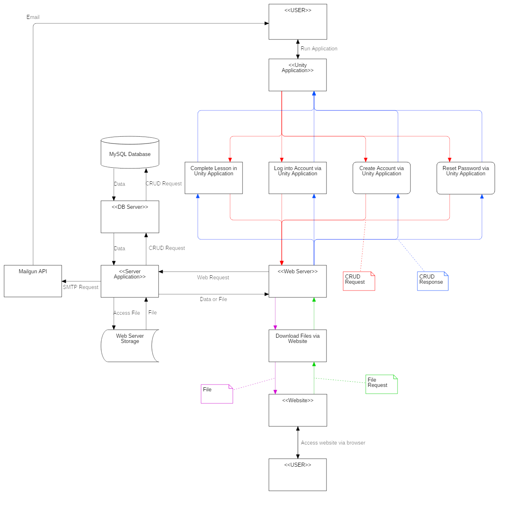

<div id="top"></div>

<!-- PROJECT LOGO -->
<div align="center">
  <a href="https://neurologicavr.com">
    
  </a>

  <h3 align="center">Neurologica VR API</h3>

  <p align="center">
    Server API for managing VR applications
    <br />
    <a href="https://neurologicavr.com/docs.html"><strong>Explore the docs »</strong></a>
    <br />
    <br />
    <a href="https://neurologicavr.com">View Latest App</a>
    ·
    <a href="https://github.com/orsoknows/nvr-api/issues">Report Bug</a>
  </p>
</div>

<!-- TABLE OF CONTENTS -->
<details>
  <summary>Table of Contents</summary>
  <ol>
    <li>
      <a href="#about-the-project">About The Project</a>
      <ul>
        <li><a href="#built-with">Built With</a></li>
      </ul>
    </li>
    <li>
      <a href="#getting-started">Getting Started</a>
      <ul>
        <li><a href="#prerequisites">Prerequisites</a></li>
        <li><a href="#installation">Installation</a></li>
      </ul>
    </li>
    <li><a href="#architecture">Architecture</a></li>
    <li><a href="#contributing">Contributing</a></li>
    <li><a href="#contact">Contact</a></li>
  </ol>
</details>

<!-- ABOUT THE PROJECT -->

## About The Project

This application was developed to serve as the backend for future VR applications developed by Neurologica VR. The goal of this organization is to provide a unique experience for users to learn various computer science related subjects. This application was specifically built for our first application Visualize Data Structures, a VR application teaching users about data structures and algorithms. This application will offer an immersive learning experience for students or free learners, and a supplementary resource for educators to teach and grade their students. The goals of the project included:

- Developing an application in Unity targeting the Oculus Quest platform
- Developing a Node.js backend application to manage web requests and database
- Developing a website for the organization

<p align="right">(<a href="#top">back to top</a>)</p>

### Built With

- [Unity](https://unity.com/)
- [Node.js](https://nodejs.org/)
- [Express.js](https://expressjs.com/)
- [MongoDB](https://mongodb.com/)
- [Bootstrap](https://getbootstrap.com)

<p align="right">(<a href="#top">back to top</a>)</p>

<!-- GETTING STARTED -->

## Getting Started

Instructions for running the NVR API locally

### Prerequisites

- Set up a database at https://mongodb.com
- Set up an account at https://mailgun.com
- Install Node.js and NPM at https://nodejs.org

### Installation

1. Clone the repo
   ```sh
   git clone https://github.com/orsoknows/nvr-api.git
   ```
2. Install NPM packages
   ```sh
   npm install
   ```
3. Rename `config.env.env` to `config.env`
4. In `config.env`...
   1. Enter your MongoDB API key
      ```js
      MONGO_URI = 'ENTER YOUR MONGODB API KEY';
      ```
   2. Enter your Mailgun API key
      ```js
      MAILGUN_API_KEY = 'ENTER YOUR MAILGUN API KEY';
      ```
      1. Enter a JWT secret key
      ```js
      JWT_SECRET = 'ENTER A JWT SECRET';
      ```
5. Run the server in development mode
   ```js
   npm run dev
   ```

<p align="right">(<a href="#top">back to top</a>)</p>

<!-- Diagrams -->

## Architecture

### Database Diagram



### Context Diagram



### Data Flow Diagram



<p align="right">(<a href="#top">back to top</a>)</p>

<!-- CONTACT -->

## Contact

Ken Orsini - [kto.dev](https://kto.dev) - korsini515@gmail.com

Brendan Chase - [chasevisualsllc.com](https://chasevisualsllc.com) - chase.brendan.k@gmail.com

Project Link: [https://github.com/orsoknows/nvr-api](https://github.com/orsoknows/nvr-api)

<p align="right">(<a href="#top">back to top</a>)</p>
